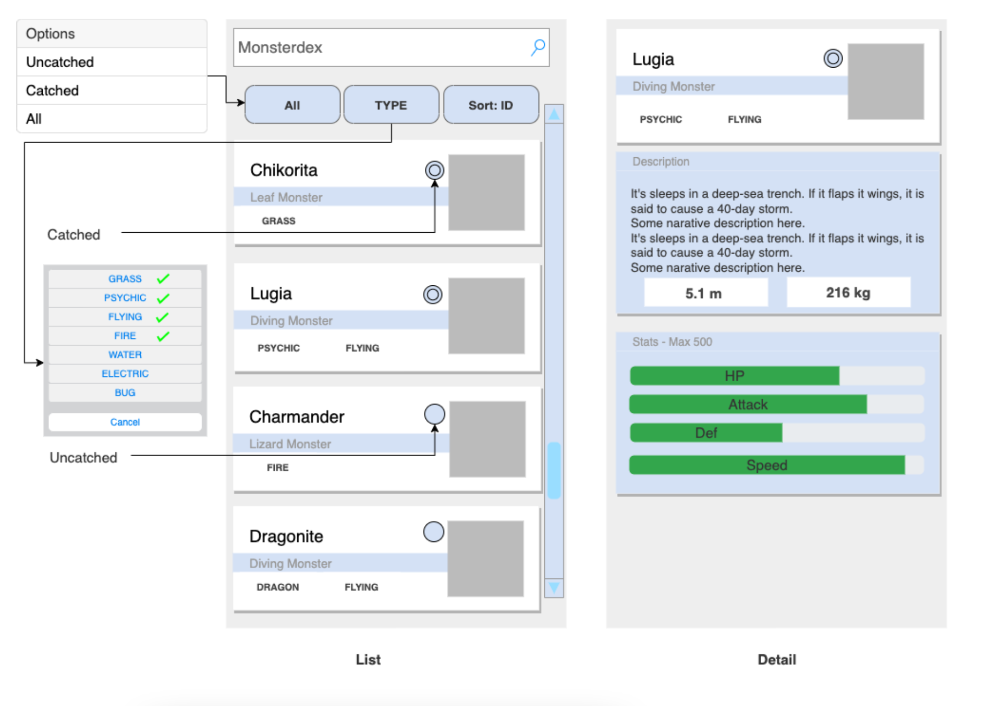

# API Contract

Our Product Team wants to get traffic or attract users with a feature like Pokedex.



Base on wireframe above we want to design the API contract.

Here for the api contract

## LIST

```json
{
  "status": 200,
  "message": "",
  "data": [
    {
      "id": 1,
      "name": "Chikorita",
      "species": "Leaf Pokémon",
      "types": [
        "GRASS"
      ],
      "catched": 1,
      "image_url": "https://img.pokemondb.net/artwork/avif/chikorita.avif"
    },
    {
      "id": 2,
      "name": "Lugia",
      "species": "Diving Pokémon",
      "types": [
        "PSYCHIC", 
        "FLYING"
      ],
      "catched": 1,
      "image_url": "https://img.pokemondb.net/artwork/avif/lugia.avif"
    },
    {
      "id": 3,
      "name": "Charmander",
      "species": "Lizard Pokémon",
      "types": ["FIRE"],
      "catched": 0,
      "image_url": "https://img.pokemondb.net/artwork/avif/charmander.avif"
    }
     {
      "id": 4,
      "name": "Dragonite",
      "species": "Dragon Pokémon",
      "types": ["DRAGON", "FLYING"],
      "catched": 0,
      "image_url": "https://img.pokemondb.net/artwork/avif/dragonite.avif"
    }
  ]
}
```

## Detail

```json
{
  "status": 200,
  "message": "",
  "data": {
    "id": 3,
    "name": "Lugia",
    "species": "Diving Pokémon",
    "types": [
      "PSYCHIC", 
      "FLYING"
    ],
    "catched": 1,
    "image_url": "https://img.pokemondb.net/artwork/avif/lugia.avif",
    "description": "Charmander is a Fire type Pokémon introduced in Generation 1. It is known as the Lizard Pokémon.",
    "weight": 216.0,
    "height": 5.2,
    "stats": {
      "hp": 106,
      "attack": 90,
      "def": 130,
      "speed": 110
    }
  }
}
```
