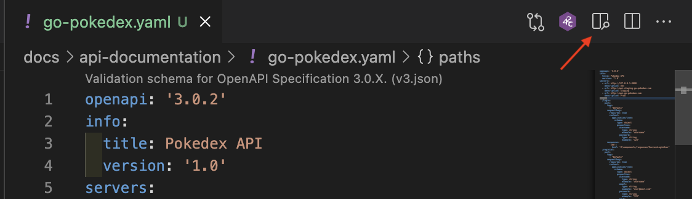
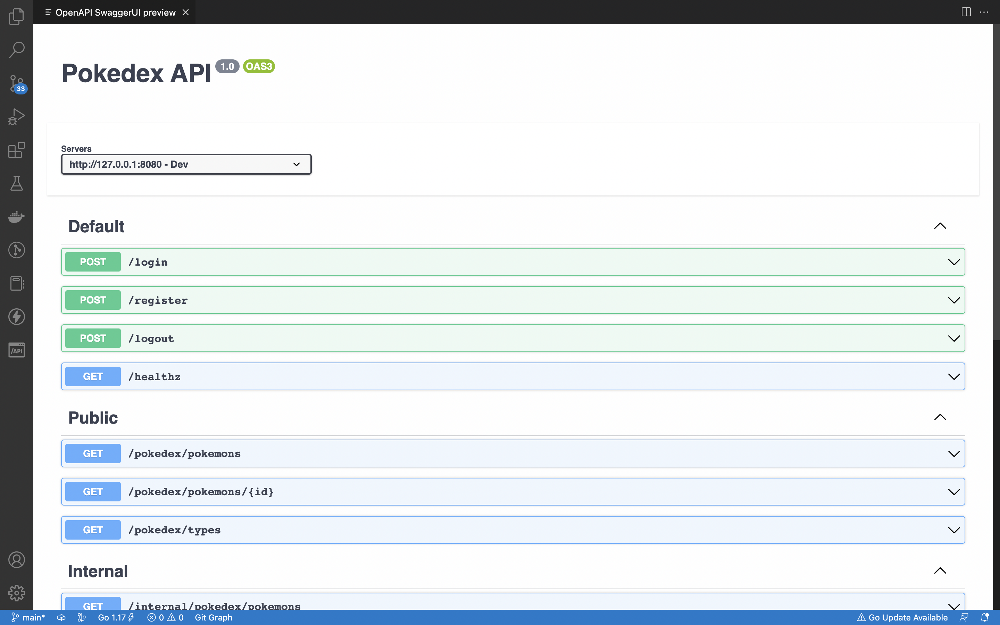

# API SPECIFICATION 

API Spec or API contract you can run the [go-pokedex.yaml](go-pokedex.yaml) or you can read from [api-documentations.md](api-documentations.md#-pokedex-api-documentation)

to run go-pokedex.yaml you can follow this step: 
- Clone this project 
  ```
  git clone git@github.com:winartodev/go-pokedex.git (via ssh)
  
  git clone https://github.com/winartodev/go-pokedex.git (via http)
  ```
- Open this project with `vs code` on your local device
- Install **OpenAPI (Swagger) Editor** plugin on `vs code`
  ```
  https://marketplace.visualstudio.com/items?itemName=42Crunch.vscode-openapi
  ```
- After installing the plugin, you can run [go-pokedex.yaml](go-pokedex.yaml) with OpenAPI \
  plugins which is marked with a red arrow (can be seen in the image below) </br> 
   

Here for the result



